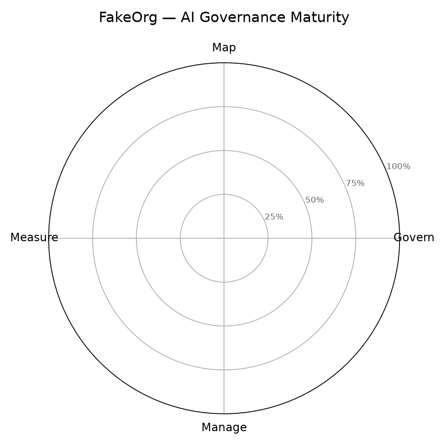

# AI Governance Risk Assessment — FakeOrg

**Engagement:** AI Governance Risk Assessment · **Period:** Q2 2026 · **Depth:** Governance-level (control & process maturity; not a technical model audit)

**Frameworks:** NIST AI RMF 1.0 (maturity scoring), EU AI Act (risk classification + obligations)

---

## 1. Executive summary

FakeOrg is a B2B SaaS — project & work-management platform organization (~520 employees) with an AI governance posture rated **emerging**.

FakeOrg has adopted AI quickly and from the bottom up, but governance has not kept pace. There is no executive owner for AI risk, no approved AI policy, and — until this engagement — no inventory of where AI is used. Maturity against the NIST AI RMF is low overall, weakest in the MEASURE function, where there is essentially no testing, monitoring, or bias evaluation. The most urgent exposure is the AI resume-screening tool: it is high-risk under the EU AI Act (Annex III employment) yet operates with no bias testing, no human-oversight procedure, no candidate notification, and no data-protection impact assessment (DPIA). The good news is that FakeOrg's existing security and privacy programs provide partial coverage to build on, and the improvement roadmap below sequences the highest-severity fixes first.

**Overall NIST AI RMF maturity:** 11.4% over 70 applicable subcategories (72 assessed; 2 N/A excluded); **16 gaps identified** (7 High, 6 Medium, 3 Low).

**Key findings**
- No executive ownership or committee for AI risk; governance is ad hoc.
- The AI acceptable-use policy is an unapproved draft with no high-risk provisions.
- The high-risk resume-screening tool lacks bias testing, human oversight, and candidate notice.
- No GDPR Art 35 DPIA for the high-risk screening tool (mandatory for systematic candidate profiling).
- MEASURE is the weakest function — no AI testing, monitoring, or metrics across the board.
- Existing vendor-security and GDPR programs give a foundation to extend to AI-specific risk.

## 2. Scope & methodology

- **AI use reviewed:** internal and customer-facing
- **In scope:**
  - All AI/ML tools and use cases across business units (internal & customer-facing)
  - Governance, policy, risk, data, vendor, and human-oversight controls
  - EU AI Act risk classification of each use case
- **Out of scope:**
  - Technical red-teaming / model security testing
  - Sub-processors' internal AI systems
  - Pure analytics/BI with no ML component
- **Stakeholders consulted:** Risk & Compliance (Head of Compliance); IT (Director of IT); Security (CISO); Business owners (VP Sales, VP Engineering, CMO, Head of Talent, Director of Support, CFO)
- **Evidence collected:** Draft AI acceptable-use policy; Vendor data sheets / DPAs; Support chatbot standard operating procedure; Partial vendor risk assessment; Security & data-protection policy excerpts

## 3. How to read this report (scoring methodology)

**NIST AI RMF maturity ratings.** Each subcategory (a desired outcome) is rated against the
evidence:

| Rating | Meaning | Weight |
|---|---|---|
| **Met** | Outcome fully achieved, documented, and operating effectively | 1.0 |
| **Partial** | Some evidence exists but gaps remain (ad hoc, undocumented, or inconsistent) | 0.5 |
| **Not Met** | Little or no evidence the outcome is achieved | 0.0 |
| **Not Applicable** | Outcome does not apply in this context — **excluded** from the maturity denominator | — |

Maturity % = (sum of weights of applicable subcategories) ÷ (count of applicable subcategories),
rolled up subcategory → category → function. The NIST AI RMF is outcome-based and intentionally
not pass/fail; this Met/Partial/Not Met overlay is the common way to make it measurable.

**What each function measures.**

- **Govern** — culture, policy, accountability, and the processes that run AI risk management.
- **Map** — establishing context: purpose, risks, impacts, and where each system is used.
- **Measure** — testing, metrics, and monitoring of AI risk and trustworthiness.
- **Manage** — prioritizing, responding to, and recovering from the risks that were mapped/measured.

**Gap severity.** Severity combines **impact** (harm to individuals, legal exposure, breadth) and
**likelihood** (a Not Met control is more likely to let a risk materialize than a Partial one):

- **High** — a high-risk-system safeguard is missing, there is direct legal exposure, or the gap is
  systemic/org-wide.
- **Medium** — a meaningful compliance or operational risk with narrower scope or lower likelihood.
- **Low** — a good-practice gap with limited immediate impact.

Each gap in §8 carries a one-line basis for its rating.

## 4. AI use-case inventory

| ID | Use case | Business unit | Owner | EU AI Act tier | Human review |
|---|---|---|---|---|---|
| UC-01 | AI resume screening | People (HR) | Head of Talent | high-risk | partial |
| UC-02 | Customer support chatbot | Customer Support | Director of Support | limited-risk | escalation |
| UC-03 | Sales copilot | Sales | VP Sales | minimal-risk | full |
| UC-04 | Code assistant | Engineering | VP Engineering | minimal-risk | full |
| UC-05 | Marketing content generation | Marketing | CMO | minimal-risk | full |
| UC-06 | Internal demand-forecasting model | Finance & Operations | CFO / FP&A | minimal-risk | full |

## 5. NIST AI RMF maturity findings

**Overall:** 11.4% over 70 applicable subcategories (72 assessed, 2 N/A)

| Function | Maturity | Assessed | Applicable |
|---|---|---|---|
| Govern | 10.5% | 19/19 | 19 |
| Map | 13.9% | 18/18 | 18 |
| Measure | 7.5% | 22/22 | 20 |
| Manage | 15.4% | 13/13 | 13 |

See `scorecard.md` for the per-category breakdown.

## 6. EU AI Act review

Risk-tier distribution across the AI inventory:

- **high-risk** (1): AI resume screening
- **limited-risk** (1): Customer support chatbot
- **minimal-risk** (4): Sales copilot, Code assistant, Marketing content generation, Internal demand-forecasting model

### UC-01 — AI resume screening · high-risk

_Annex III.4 (employment/recruitment); performs profiling, so always high-risk (Art 6(3), final subparagraph)._

| Obligation | Status | Note |
|---|---|---|
| Art 26(1) — Use in accordance with the provider's instructions for use | Partial | Used on vendor defaults; no documented instructions-for-use on file. |
| Art 26(2) — Assign competent, trained human oversight | Not Met | No named, trained overseer; recruiters rely on the ranking without guidance. |
| Art 26(5) — Monitor operation; report serious incidents | Not Met | No monitoring of outcomes or incident-reporting path. |
| Art 26(6) — Keep logs for at least 6 months (where under deployer control) | Partial | Vendor retains logs; FakeOrg has no defined retention/access control. |
| Art 26(11) — Inform affected persons subject to Annex III decisions | Not Met | Candidates are not told AI screening is used. |
| Art 27 (FRIA) — Fundamental Rights Impact Assessment — applicability | Not Applicable | Not triggered: Art 27 binds public bodies, public-service providers, and Annex III 5(b)/(c) deployers; a private employer under Annex III.4 is out of scope. The binding instrument here is a GDPR Art 35 DPIA (systematic candidate profiling); a voluntary FRIA-style review is recommended good practice (see GAP-07).
 |
| Art 86 — Provide affected persons a meaningful explanation | Not Met | No mechanism for candidates to obtain an explanation. |

### UC-02 — Customer support chatbot · limited-risk

_Article 50(1) transparency — users must be told they interact with an AI. FakeOrg assembles the chatbot (helpdesk platform + third-party LLM) and exposes it under its own brand, so it acts as the provider/operator on whom the Art 50(1) disclosure duty falls.
_

| Obligation | Status | Note |
|---|---|---|
| Art 50(1) — Disclose to users that they are interacting with an AI | Partial | Disclosed on the web widget but not in the in-app chat — inconsistent. |

## 7. Detailed findings

The most material findings, with their regulatory basis, impact, and recommended action.

### High-risk resume screening operating without safeguards · High

**Use case:** UC-01 — AI resume screening

**Regulatory hook:** High-risk under the EU AI Act (Annex III.4 employment; profiling makes it always high-risk, Art 6(3) final subparagraph). Engages deployer duties Art 26(2) human oversight and Art 26(11) candidate notification, plus a mandatory GDPR Art 35 DPIA for systematic profiling. Maps to NIST MEASURE 2.11 (fairness/bias) and MAP 3.5 (human oversight).

**Impact:** An untested ranking model can systematically disadvantage protected groups, producing discriminatory hiring outcomes. Because no human-oversight procedure exists, recruiters defer to the score — the AI effectively makes the decision. Exposure spans discrimination liability, GDPR enforcement, and reputational harm.

**Affected:** Job applicants (external individuals), especially members of protected groups; and FakeOrg's legal and brand standing.

**Recommendation:** Run a bias/adverse-impact audit (ACT-04), implement a human-oversight SOP (ACT-05), notify candidates (ACT-06), and complete a GDPR Art 35 DPIA (ACT-07). This is the highest-priority cluster of gaps.

### No AI governance ownership or policy (systemic root cause) · High

**Use case:** Organization-wide

**Regulatory hook:** NIST AI RMF GOVERN 1.2, 2.1, 2.3 — the cross-cutting foundation on which Map, Measure, and Manage depend. Also underpins any demonstrable due-diligence story for regulators/customers.

**Impact:** With no accountable executive and no approved policy, AI risk is never consistently identified, prioritized, or remediated — so every other gap persists by default. The organization cannot show it governs AI, which is increasingly a customer and procurement question.

**Affected:** The whole organization; customers and regulators relying on governance assurances.

**Recommendation:** Establish an AI governance committee with an executive owner (ACT-01), approve the AI policy (ACT-02), and stand up a risk-management process with risk tolerances (ACT-09).

### Customer-facing chatbot transparency gap · Medium

**Use case:** UC-02 — Customer support chatbot

**Regulatory hook:** EU AI Act Art 50(1) transparency — the disclosure duty falls on FakeOrg as the provider/operator of the assembled chatbot. Maps to NIST MEASURE 2.4 (production monitoring) and 3.3 (user feedback).

**Impact:** Users on the in-app surface may not realize they are interacting with AI, and there is no evaluation of harmful or incorrect responses. Individual harm is modest, but it is a clear, low-cost compliance gap to close before Art 50 applies (2 Aug 2026).

**Affected:** Customers using in-app support.

**Recommendation:** Show a consistent AI disclosure across every chatbot surface (ACT-06) and add output evaluation plus an appeal channel (ACT-10).

## 8. Key gaps & risks

**16 gaps** — 7 High · 6 Medium · 3 Low. Severity basis is defined in §3.

| ID | Severity | Gap | Mapping | Risk & severity basis |
|---|---|---|---|---|
| GAP-01 | High | No AI governance ownership or committee | GOVERN 2.1, GOVERN 2.3 | AI decisions are made ad hoc with no accountability; risks go unmanaged across the org. _Why High: Systemic root cause — without an owner, no other gap reliably gets fixed; org-wide impact, near-certain to persist._ |
| GAP-02 | High | No approved AI policy | GOVERN 1.2, GOVERN 4.1 | Staff lack binding guidance; inconsistent and unsafe AI use. _Why High: Foundational control absent; affects every employee's AI use, high likelihood of inconsistent/unsafe practice._ |
| GAP-03 | Medium | No AI use-case register or intake process | GOVERN 1.6 | Shadow AI proliferates; the org cannot see or govern what it runs. _Why Medium: Process control, not a direct individual harm; enables other risks but impact is indirect._ |
| GAP-04 | High | No bias/fairness testing of high-risk resume screening | MEASURE 2.11 | Potential discriminatory hiring outcomes; legal and reputational exposure. _Why High: High-risk system; missing safeguard can directly harm candidates (discrimination) with clear legal exposure._ |
| GAP-05 | High | No human-oversight design for resume screening | Art 26(2), MAP 3.5 | Automation bias; the AI effectively makes hiring decisions unchecked. _Why High: High-risk system effectively deciding unchecked; EU Art 26(2) deployer duty; affects candidates directly._ |
| GAP-06 | High | Candidates not informed of AI use | Art 26(11) | Breach of EU AI Act deployer transparency duty for high-risk systems. _Why High: Direct breach of an in-force transparency duty for a high-risk system; affects every applicant._ |
| GAP-07 | High | No DPIA or fundamental-rights review for the high-risk screening tool | GDPR Art 35, MEASURE 2.10 | A GDPR Art 35 DPIA is mandatory for systematic candidate profiling, and rights impacts are unassessed. (Note: an EU AI Act Art 27 FRIA is NOT triggered for a private Annex III.4 deployer.)
 _Why High: GDPR Art 35 DPIA is legally mandatory for this profiling; non-compliance plus unassessed rights impacts on candidates._ |
| GAP-08 | Medium | Inconsistent AI disclosure on support chatbot | Art 50(1) | Transparency-obligation gap; users may not know they are talking to AI. _Why Medium: Real transparency gap but limited harm — users still reach human agents; partial coverage already exists._ |
| GAP-09 | Medium | No AI-specific vendor assessment | GOVERN 6.1, MANAGE 3.1 | Third-party AI risk is unmanaged; unclear whether customer data trains vendor models. _Why Medium: Latent third-party risk across several tools; impact data-dependent, likelihood moderate._ |
| GAP-10 | Medium | Shadow AI and no data-handling guidance | GOVERN 1.1, MAP 4.1 | Confidential data or source code may leak to third-party AI services. _Why Medium: Plausible data/IP leakage; impact significant but likelihood and exposure depend on user behaviour._ |
| GAP-11 | Medium | No model documentation for in-house forecasting model | MAP 2.3, MEASURE 2.9, MANAGE 3.2 | Undetected model drift; loss of capability if the owner leaves. _Why Medium: Operational/internal impact only (no external individuals); drift and key-person risk are real but contained._ |
| GAP-12 | High | No AI risk-management process or risk tolerances | GOVERN 1.3, GOVERN 1.4, MAP 1.5 | Risks are neither prioritized nor treated consistently. _Why High: Systemic — with no process or tolerances nothing is prioritized or treated; underpins most other gaps._ |
| GAP-13 | Medium | No AI incident response or deactivation capability | MANAGE 2.4, MANAGE 4.1 | A misbehaving AI system cannot be promptly detected or stopped. _Why Medium: High impact if triggered, but lower likelihood; a general incident process gives partial fallback._ |
| GAP-14 | Low | No AI risk-management training | GOVERN 2.2 | Personnel cannot execute governance duties they are unaware of. _Why Low: Enabling weakness rather than a direct harm; impact realized only via other gaps._ |
| GAP-15 | Low | No chatbot output evaluation or log-retention policy | MEASURE 2.4 | Harmful answers go undetected; privacy/retention exposure on stored chats. _Why Low: Limited immediate harm; privacy exposure is latent and bounded to support interactions._ |
| GAP-16 | Low | No user appeal, feedback, or explanation channel for AI outcomes | MEASURE 3.3, Art 86 | Errors persist; affected people have no recourse or right to explanation (EU AI Act Art 86). _Why Low: Real but lower near-term impact; the Art 86 right to explanation applies from Aug 2026, giving lead time._ |

## 9. Governance improvement plan

| ID | Priority | Action | Owner | Target | Success measure |
|---|---|---|---|---|---|
| ACT-01 | High | Establish an AI governance committee and assign an executive owner. | Executive sponsor (CISO chairs) | 2026-Q3 | Chartered committee meets monthly; named accountable executive. |
| ACT-02 | High | Finalize and approve the AI acceptable-use policy, including high-risk provisions. | Head of Compliance | 2026-Q3 | Board-approved policy published; staff attestation complete. |
| ACT-03 | Medium | Stand up a central AI use-case register with an intake and review gate. | Director of IT | 2026-Q3 | 100% of known AI tools registered; new tools reviewed before adoption. |
| ACT-04 | High | Commission a bias/adverse-impact audit of the resume-screening tool. | Head of Talent (with vendor) | 2026-Q3 | Documented bias audit with remediation actions tracked. |
| ACT-05 | High | Define and implement a human-oversight SOP for resume screening. | Head of Talent | 2026-Q4 | Documented SOP; recruiters trained; override/review rate monitored. |
| ACT-06 | High | Add AI transparency notices — inform candidates; fix chatbot disclosure everywhere. | Head of Talent and Director of Support | 2026-Q3 | Candidate notice live; AI disclosure shown in all chatbot surfaces. |
| ACT-07 | High | Complete a GDPR Art 35 DPIA for the resume-screening tool (plus a voluntary fundamental-rights review). | Head of Compliance / DPO | 2026-Q4 | DPIA completed and filed; mitigations assigned and tracked. |
| ACT-08 | Medium | Extend vendor risk assessment with an AI module (bias, training-data use, model docs). | Security & IT | 2026-Q4 | All AI vendors re-assessed with the AI module; gaps logged. |
| ACT-09 | Medium | Roll out an AI risk-management process, risk tolerances, and staff training. | Head of Compliance | 2027-Q1 | Documented process in use; risk tolerances approved; >90% trained. |
| ACT-10 | Medium | Define AI incident response, post-deployment monitoring, deactivation, and appeal channels. | CISO and Director of Support | 2027-Q1 | AI incident runbook tested; appeal + explanation channel live (Art 86); monitoring in place. |
